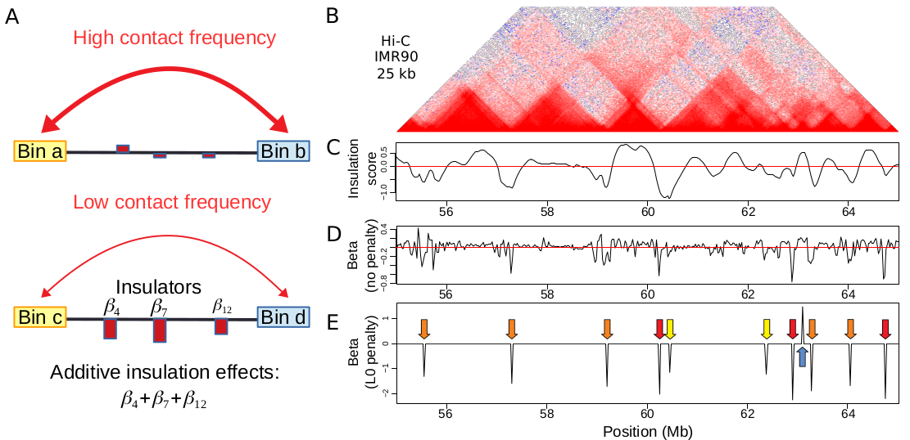

# TADreg: A versatile regression framework for TAD identification, differential analysis and prediction

# Overview
We propose a versatile regression framework which not only identifies TADs in a fast and accurate manner, but also detects
differential TAD borders across conditions for which few methods exist, and predicts 3D genome reorganization after chromosomal rearrangement. Moreover, the framework is biologically meaningful, has
an intuitive interpretation and is easy to visualize.

# Requirements

The scripts were written in R language.

To run the scripts, you need several R packages. To install the packages: 
install.packages(c("devtools","Matrix","glmnet","data.table","ggplot2","circlize","mgcv","L0Learn","doMC"))
BiocManager::install(c("BSgenome.Mmusculus.UCSC.mm10","rtracklayer","GenomicRanges","HiTC","hicrep"))

For R > 4.0.0, the installation of "hicrep" might not work with BiocManager for some reasons. Instead, you could install "hicrep" directly from the github repository:  
library(devtools)  
remotes::install_github("aidenlab/straw/R")  
devtools::install_github(“TaoYang-dev/hicrep”)

# Installation

library(devtools)  
devtools::install_github("morphos30/TADreg")  

# Usage

In the folder Tutorial, you will find an R Markdown file main_package.html which will explain with examples how to use TADreg R package.

# Folders

In this package, there are three main folders:

- The folder "data" contains: Hi-C data matrices formatted as HiTC R objects (https://www.bioconductor.org/packages//2.10/bioc/html/HiTC.html).
- The folder "script" contains one main R script "main_package.R" for contains examples for running the three functions SIM (TAD border identification), DIM (differential TAD border detection) and PIM (prediction of rearranged 3D genome). 
- The folder "results" contains three subfolders: SIM (TAD border identification), DIM (differential TAD border detection) and PIM (prediction of rearranged 3D genome). In the folders, there are already plots illustrating the results obtained from the three functions.

# Importing data from standard Hi-C processing pipelines
The function ProcData(htc,distMax=2.5e6) from TADreg processes data from HTCexp object from the HiTC R package format :).
https://bioconductor.org/packages/release/bioc/manuals/HiTC/man/HiTC.pdf

# From Juicer
In TADreg, you will find a function to import Hi-C data from Juicer dump format.

HTCfromJuicerDump(file_juicer_dump, resolution, chr, assembly, sparse=T)

The function will return a HTCexp object from HiTC R package.

# From HiC-pro
HiC-Pro is compatible with HiTC R package (same author).
https://bioconductor.org/packages/release/bioc/manuals/HiTC/man/HiTC.pdf

See explanations from:
https://github.com/nservant/HiC-Pro/blob/master/doc/COMPATIBILITY.md

For instance:
hic<-importC("HI-C-hrpL-KB_29000_iced.matrix","HI-C-hrpL-KB_29000_abs.bed")

# From any other tools 
You can convert most Hi-C formats to Juicer format with hicConvertFormat from HiC explorer.

https://hicexplorer.readthedocs.io/en/latest/content/tools/hicConvertFormat.html

# Reference
Raphaël Mourad, TADreg: a versatile regression framework for TAD identification, differential analysis and rearranged 3D genome prediction. 
BMC Bioinformatics. 2022 Mar 2;23(1):82. doi: 10.1186/s12859-022-04614-0. 
https://bmcbioinformatics.biomedcentral.com/articles/10.1186/s12859-022-04614-0

# Contact: 
raphael.mourad@univ-tlse3.fr
